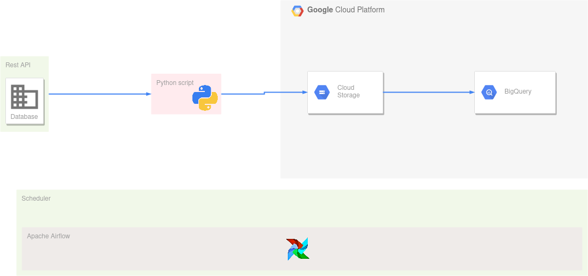

# lambda-data-ingest

In this mini project we are going to ingest data from the [NewYork city Taxi & Limousine Comission](https://www1.nyc.gov/site/tlc/about/tlc-trip-record-data.page) for TLC trip record data in january 2021. The ingestin will focuses on [Yellow taxi trip records](https://s3.amazonaws.com/nyc-tlc/trip+data/yellow_tripdata_2021-01.csv) and [High Volume Fr-Hire vehicule trip records](https://nyc-tlc.s3.amazonaws.com/trip+data/fhvhv_tripdata_2021-01.csv).

# Pipeline

So we'll :

- download data from the source url as .CSV file
- Transform it into parquet
- Upload them to a google cloud storage bucket
- Finally transfer them to a table in a Bigquery dataset instance
  
The all will be orchestrate by an airflow server


# How to setup

## Pre-requisites

- Make sure you've a GCP active account.
- Docker and Docker-compose installed.
- Terraform installed.
- Create a service account grant it privileges to access cloud storage and bigquery storage in writing.
- Create a .JSON key for the service account and save it on your local computer.
- Place it in  ```~/.google/credentials/```
  
## Run

First create the project in the GCP console.
In the repo directory:

```bash
cd terraform/
terraform init
terraform apply
```

After:

```bash
cd ../airflow/
docker build .
docker-compose up airflow-init
docker-compose up
```

With all the services up, you can go to the [Airflow login page](http://localhost:8080) to enter the apache airflow wbserver. By default the credentials are 'airflow' for the login and 'airflow' for the password(to change if you want to put such system in production). You'll see the dags on the dashbard page that you can trigger.
